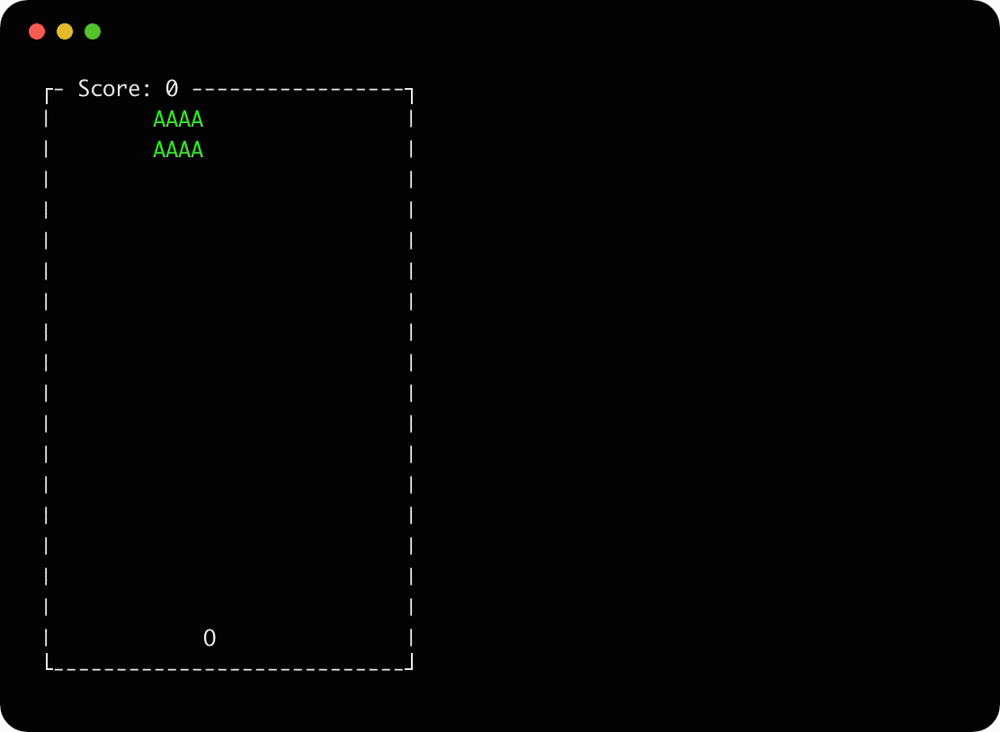

  

# 🚀 Space Invaders
## Description
  The game is terminal based version of space invaders. 
  The goal of the game is to shoot as many aliens as possible before you lose all of your lives.
  The game is highscore based as there is no completion to the game.
  Aliens can be shot by the player and will denote damage by changing color and disappearing when killed.
  The player has 2 lives and will lose a life by either an alien touching the player, or the bottom of the window.
  When the player loses all their lives the game is over and the score is noted on the top of the window.

## Getting Started

### Compiling
- Navigate to root directory of repository
- run `./compile.sh`
### Running
- Navigate to root directory of repository
- run `./bin/main`

## Gameplay
The player entity that you control is represented as an `0` character, that is on the bottom of the window. 
The player can move left and right with the respective arrow key, as well as shoot using the up arrow key.
Aliens are represented as an `A` character and move downwards from the top of the window.
When the game is over, it can be quit with `ctrl+c`.

## Contribution
- Branden Rice: Diagrams, board, and game engine development 
- Carter McCullum: Board, game engine, and model development
- Mackenzie Boudreau: Board and game engine development
- Ian Page: Diagrams, model, and collision development
